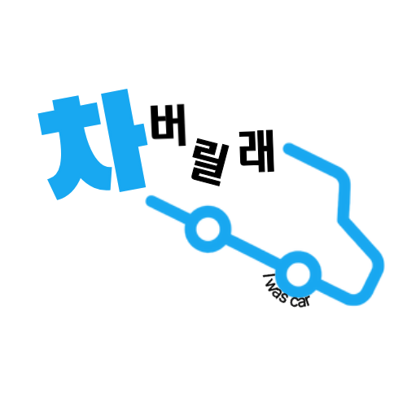
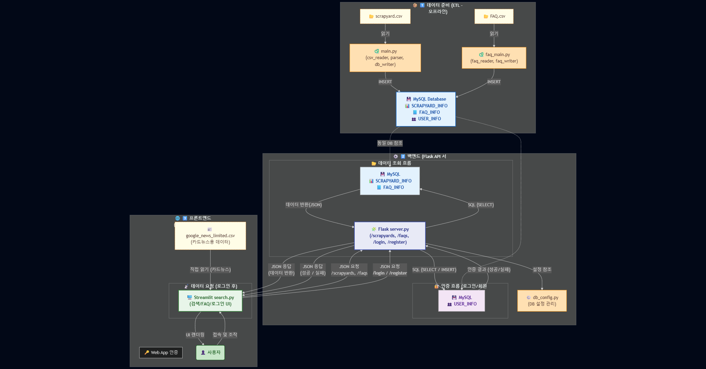
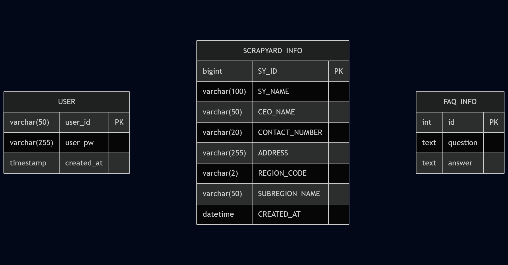
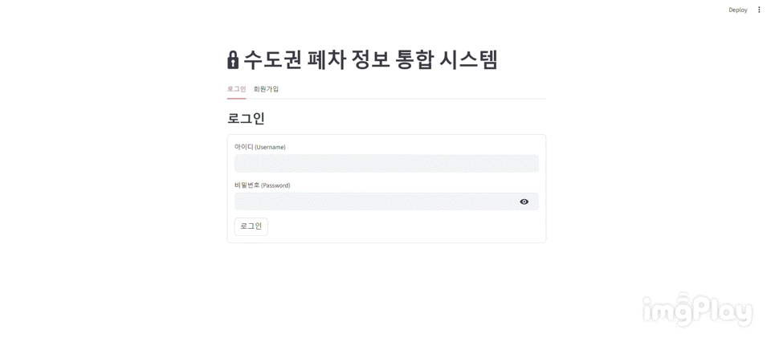

# 폐차 정보 조회 플랫폼 차 버릴래

폐차장 조회 및 정보 플랫폼.

## 📋 프로젝트 개요
**차 버릴래**는 수도권 지역의 폐차장 위치를 확인하고, 절차, 통계를 확인할 수 있는 플랫폼입니다.

## 🎯 필요성
- 공공데이터와 크롤링 데이터를 기반으로 폐차에 필요한 절차와 통계, 위치파악 가능.
- 필요한 통계 데이터를 다운로드 가능.

## 👥 팀 구성 및 역할 분담

**Team 차 버릴래**
<table>
<tr>
<td align="center" width="200" style="vertical-align: top; height: 300px;">
  
   
  <h3 style="margin: 10px 0 5px 0;">박수빈</h3>
  
역할 | PM

  

    
  

</td>

<td align="center" width="200" style="vertical-align: top; height: 300px;">

   
 
<h3 style="margin: 10px 0 5px 0;">신지용</h3>

역할 | BACK

</td>
<td align="center" width="200" style="vertical-align: top; height: 300px;">

   
 
<h3 style="margin: 10px 0 5px 0;">최자슈아주원</h3>

역할 | BACK

</td>
<td align="center" width="200" style="vertical-align: top; height: 300px;">

 
<h3 style="margin: 10px 0 5px 0;">이의정</h3>

역할 | 크롤링

</td>
<td align="center" width="200" style="vertical-align: top; height: 300px;">

 
<h3 style="margin: 10px 0 5px 0;">장이선</h3>

역할 | DB/FRONT

<td align="center" width="200" style="vertical-align: top; height: 300px;">

 
<h3 style="margin: 10px 0 5px 0;">문지영</h3>

역할 | FRONT

</td>
</tr>
</table>

## 기술 스택

### Frontend

### Backend & Database

### Data Processing & Analysis

### Web Scraping

## 📂 프로젝트 구조

본 프로젝트는 **데이터 사전 처리 단계**와 **실시간 조회 서비스 단계**로 구성되어 있습니다.

---

### 🔹 1. 데이터 사전 처리 (Pre-processing)
애플리케이션 서버가 실행되기 전, 사용자에게 제공할 데이터를 미리 준비하는 단계입니다.

- **데이터 수집:** Python을 이용해 필요한 원본 데이터를 크롤링합니다.  
- **데이터 저장 (1차):** 수집된 데이터를 CSV 파일 형태로 로컬에 저장합니다.  
- **데이터베이스 적재 (Pre-load):** 저장된 CSV 파일을 가공하여 메인 데이터베이스(MySQL)에 삽입(Insert)합니다.  

> 📌 이 과정을 통해 서버는 항상 정제된 최신 데이터를 기준으로 실행을 시작합니다.

---

### 🔹 2. 실시간 조회 서비스 (Runtime Flow)
사용자가 시스템을 이용하는 실제 동작 흐름입니다.  
프론트엔드(Streamlit)와 백엔드(Flask)가 명확히 분리되어 동작합니다.

1️⃣ **사용자 인증:**  
사용자는 Streamlit(프론트엔드) 화면을 통해 시스템에 로그인합니다.

2️⃣ **데이터 요청 (Front → Back):**  
사용자가 특정 데이터를 조회하면, Streamlit은 조회에 필요한 파라미터(검색어, 조건 등)를  
JSON 형식으로 구성하여 Flask(백엔드) API 서버에 전송(Request)합니다.

3️⃣ **백엔드 처리 (Back-end Logic):**  
- Flask 서버는 수신한 JSON 데이터를 파싱(Parsing)합니다.  
- 파싱된 파라미터를 기반으로 적절한 SQL 쿼리문을 생성합니다.  
- 생성된 SQL을 데이터베이스(DB)로 전송하여 실시간으로 데이터를 조회합니다.

4️⃣ **데이터 응답 (Back → Front):**  
DB로부터 조회된 결과값을 다시 JSON 형식으로 가공하여 Streamlit으로 응답(Response)합니다.

5️⃣ **결과 표시:**  
Streamlit은 응답받은 데이터를 이용해 사용자 화면에 조회 결과를 동적으로 표시합니다.

## 데이터베이스 구조

## 🧱 테이블 요약
| 테이블명 | 설명 | 주요 컬럼 |
|-----------|-------|------------|
| **USER** | 사용자 계정 및 로그인 정보 관리 | `user_id`, `user_pw`, `created_at` |
| **SCRAPYARD_INFO** | 수도권 폐차장 정보 저장 | `SY_NAME`, `ADDRESS`, `REGION_CODE`, `SUBREGION_NAME`, `CREATED_AT` |
| **FAQ_INFO** | 자주 묻는 질문(FAQ) 데이터 관리 | `question`, `answer`, `created_at` |

## ⚙️ 주요 특징
- **3개의 주요 테이블(USER / SCRAPYARD_INFO / FAQ_INFO)** 로 구성  
- **REGION_CODE / SUBREGION_NAME** 기준으로 지역별 폐차장 검색 가능  
- **AUTO_INCREMENT + 기본 타임스탬프** 적용으로 관리 용이  
- **Streamlit ↔ Flask ↔ MySQL** 간 연동 구조에 최적화  
- 추후 `USER`를 기반으로 등록자·관리자 기능 등 확장 가능  

## 주요 기능

## 1. 🏠 메인 도메인 화면 (문지영)
- Streamlit 기반의 전체 UI/UX 설계 및 구현.
- 프로젝트의 홈 화면(메인 페이지)과 주요 기능 페이지 간의 내비게이션 구조를 구축.

## 2. 🔍 폐차장 검색 / 🔐 로그인 시스템 (신지용)
- DB에 있는 user정보를 통해 로그인 시스템 구현.
- 수도권 폐차장 검색.
- 크롤링 된 Data를 기반으로 상세 정보 제공.

## 3. 📍 지도 위치 시스템 (장이선)
- 조회 된 폐차장을 카카오맵에 구현.

## 4. 📰 카드 뉴스 (이의정)
- 폐차와 관련된, 다양한 언론사의 뉴스정보를 제공.

## 5. 📊 실적 데이터 (박수빈)
- 최근 약 10년간의 조건에 따른 전국 폐차 정보 제공.
- 필요한 데이터 액셀 형태로 다운로드 제공.
- 시각화 된, 차트 및 표 제공.

## 6. ❓ FAQ (Joshua Juwon Choi)
- 폐차와 관련하여 자주 묻는 질문 List 를 출력.
- 클릭 시, 답변 제공.

## 📚 자료 출처
한국자동차해체재활용협동조합(KADCO, Korea Automobile Recycling cooperative) 
https://www.kadra.or.kr/kadra/contents/main/main.html

## 📈 기대효과

### 사용자
- 수도권 이용자들의 폐차를 위한 위치 확인 가능.
- 폐차 이전, 필요한 정보를 제공하여 선택지를 지원.
- 통계 정보를 통한, 수도권 폐차 정보 확인에 용이.

### 학습/팀 성과
- 공공데이터 + 크롤링 + DB + 시각화 프로젝트 경험
- Python, MySQL, Streamlit, Web Crawling 등 학습 내용을 종합 적용
- Flask 기반의 백엔드 API 서버를 구축, 사용자 요청에 따라 DB와 실시간으로 연동하여 최신화된 데이터를 JSON 형태로 제공하도록 구현.
- GitHub 협업과 DB 실습을 통한 실무 능력 강화

## 추가 구현하고 싶은 기능
- 폐차 보조금에 대한 업체를 광고 할 수 있는 게시판
- 로그인 한 유저를 관리할 수 있는 AdminPage 및 Adming 권한 Table
- 일정시간 페이지 비이동 시, TimeOut 기능
- 사용자 폐차 등록 게시판 구현
- 뉴스기사 사이트 별로 실시간 크롤링 구현

### 아쉬운 점
- 폐차장과 관련 된 Data들의 크롤링이 쉽지 않아, 통계의 경우 엑셀파일을 Convert 하는 모듈을 작업하여 사용한 것.
- 시간의 부재로 flask API를 사용한 DB의 연동이 불안정한 사항.

## 회고
- 박수빈 상대적으로 프로그래밍 보단 설계 및 도움을 줄 수 있는 PM역할을 맡아 좋은 경험을 한거 같아 좋습니다.
    같이 열심히 해주신 팀원분들에게 감사인사 올립니다.

- 문지영: 이번 프로젝트에서 Streamlit 기반의 프론트엔드 개발을 맡아 시스템의 사용자 접점을 구현했습니다. 가장 어려웠던 점은 Streamlit의 상태 관리와 디자인 커스터마이징이었습니다. 검색 결과 반영이나 메뉴 전환 시 st.rerun()과 st.session_state를 명확히 제어해야 안정적인 화면 업데이트가 가능했습니다. 또한, 기본 Streamlit 버튼의 한계를 넘어서기 위해 CSS와 JavaScript 인젝션을 사용하여 사이드바 메뉴의 선택 상태 강조나 버튼 스타일을 구현하는 데 시간을 많이 할애했습니다. Plotly를 이용한 시각화와 카카오 지도 임베딩까지 파이썬 환경 내에서 통합적으로 처리할 수 있었던 점이 큰 성과였습니다. 이 과정을 통해 백엔드 API와의 연동 흐름과 데이터 요청/응답 처리의 중요성을 체감할 수 있었습니다. 사용자에게 직관적이고 깔끔한 UI를 제공하는 시스템을 완성했다는 것에 큰 보람을 느꼈습니다. 이번 프론트엔드 경험이 남은 프로젝트를 진행할 자신감을 주었고, 팀원들의 협업 속에서 개발의 전체 흐름을 명확히 이해할 수 있었습니다. 팀원들의 적극적인 협력과 열정 덕분에 프로젝트를 성공적으로 마무리할 수 있었던 거 같아 감사드립니다.

- 최자슈아주원: 처음으로 진행하는 프로젝트에서 FAQ 부분 백엔드를 맡게 되었는데 같이 백엔드를 맡은 지용님께서 많이 도와주셔서 감사했습니다. 또, 모르는게 생겼을 때 바로바로 방향을 잡아주신 수빈님도 감사드립니다. csv-> db -> api -> streamlit 이렇게 데이터를 보내는데 저 모든 과정마다 오류가 발생했고 그때마다 오류를 수정하는데 많은 시간을 할애했습니다. 중간에 힘이 들고 뭔지 모르겠을 때 힘이 들었지만 모두가 노력하고 있어 포기하지 않고 끝까지 갈 수 있었던 것 같습니다. streamlit에 모두의 노력이 합쳐졌을 때 엄청난 만족감을 느끼었고 이번 프로젝트는 GPT의 비중이 많이 높았지만 점차 줄여나갔으면 하는 바램입니다.  

- 신지용: 백엔드 파트에서 전체적인 모듈관리 및 코드병합 그리고 Flask API 서버 구현과 DB 연동을 담당했습니다. 프론트엔드에서 발생하는 사용자 요청(폐차장 검색 등)을 실시간으로 처리하고, DB와 통신하여 결과를 반환하는 백엔드의 핵심 로직을 구현했습니다. 특히, 프론트엔드 팀과 원활한 데이터 통신을 위해 API 명세를 정의하고, 백엔드를 함께 맡은 주원님과 협력하여 DB 데이터를 JSON으로 가공하는 작업에 집중했습니다.'아쉬운 점'에서 언급했듯 시간 제약으로 API의 안정성을 완벽하게 다듬지 못한 점이 마음에 남지만, 팀원들의 코드를 병합하며 전체 시스템을 통합해본 경험은 백엔드 개발자로서 큰 자산이 되었습니다.

- 장이선 : DBA를 맡았는데, 생각보다 쉬운 작업이었어서 다행이라고 생각했습니다. 팀원분들의 노고에 감사드립니다.

- 이의정 : 이번 경험을 통해 웹 크롤링을 처음 접해보았고, 이 작업이 일상에서도 매우 유용하게 활용될 수 있는 기술이라는 점을 느꼈습니다. 앞으로 웹 크롤링과 데이터 수집 분야를 더 깊이 공부해보고 싶다는 생각이 들었습니다.
또한 팀 프로젝트를 진행하면서 개인 프로젝트와 달리 Git을 사용할 때 충돌(conflict) 이 자주 발생한다는 점을 직접 경험했습니다. 그 과정에서 협업 시 코드 관리의 중요성을 배울 수 있었고, 제 부족한 부분도 명확히 인식하게 되었습니다. 짧은 시간이었지만 좋은 팀원분들을 만나 함께 노력하며 프로젝트를 성공적으로 마무리할 수 있었습니다. 모두 고생 많으셨습니다. 감사합니다. 
