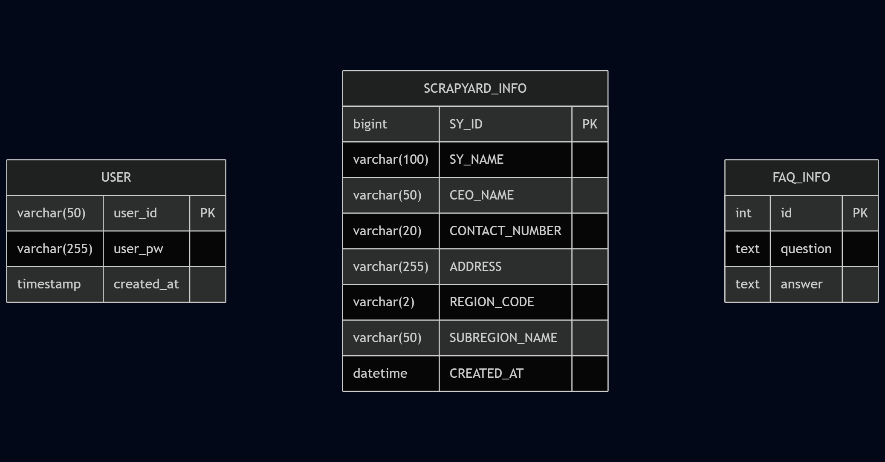

# 폐차 정보 조회 플랫폼 차 버릴래

폐차장 조회 및 정보 플랫폼.

## 📋 프로젝트 개요
**차 버릴래**는 수도권 지역의 폐차장 위치를 확인하고, 절차, 통계를 확인할 수 있는 플랫폼입니다.

## 🎯 필요성
- 공공데이터와 크롤링 데이터를 기반으로 폐차에 필요한 절차와 통계, 위치파악 가능.
- 필요한 통계 데이터를 다운로드 가능.

## 👥 팀 구성 및 역할 분담

**Team 차 버릴래**
<table>
<tr>
<td align="center" width="200" style="vertical-align: top; height: 300px;">
  
   
  <h3 style="margin: 10px 0 5px 0;">박수빈</h3>
  
역할 | PM

  

    
  

</td>

<td align="center" width="200" style="vertical-align: top; height: 300px;">

   
 
<h3 style="margin: 10px 0 5px 0;">신지용</h3>

역할 | BACK

</td>
<td align="center" width="200" style="vertical-align: top; height: 300px;">

   
 
<h3 style="margin: 10px 0 5px 0;">최자슈아주원</h3>

역할 | BACK

</td>
<td align="center" width="200" style="vertical-align: top; height: 300px;">

 
<h3 style="margin: 10px 0 5px 0;">이의정</h3>

역할 | 크롤링

</td>
<td align="center" width="200" style="vertical-align: top; height: 300px;">

 
<h3 style="margin: 10px 0 5px 0;">장이선</h3>

역할 | DB/FRONT

<td align="center" width="200" style="vertical-align: top; height: 300px;">

 
<h3 style="margin: 10px 0 5px 0;">문지영</h3>

역할 | FRONT

</td>
</tr>
</table>

## 기술 스택

### Frontend

### Backend & Database

### Data Processing & Analysis

### Web Scraping

## 프로젝트 구조

## 데이터베이스 구조

## 주요 기능

## 1. 🔍 메인 도메인 화면 (문지영)
- 여러 메뉴로 갈 수 있는 버튼 구현.
- 사용자 친화적인 UI 사용.

## 2. 🔍 폐차장 검색 / 로그인 시스템 (신지용)
- DB에 있는 user정보를 통해 로그인 시스템 구현.
- 수도권 폐차장 검색.
- 크롤링 된 Data를 기반으로 상세 정보 제공.

## 3. 🔍 지도 위치 시스템 (장이선)
- 조회 된 폐차장을 카카오맵에 구현.

## 4. 📰 카드 뉴스 (이의정)
- 폐차와 관련된, 다양한 언론사의 뉴스정보를 제공.

## 5. 📊 실적 데이터 (박수빈)
- 최근 약 10년간의 조건에 따른 전국 폐차 정보 제공.
- 필요한 데이터 액셀 형태로 다운로드 제공.
- 시각화 된, 차트 및 표 제공.

## 6. ❓ FAQ (Joshua Juwon Choi)
- 폐차와 관련하여 자주 묻는 질문 List 를 출력.
- 클릭 시, 답변 제공.

## 📚 자료 출처
한국자동차해체재활용협동조합(KADCO, Korea Automobile Recycling cooperative) 
https://www.kadra.or.kr/kadra/contents/main/main.html

## 📈 기대효과

### 사용자
- 수도권 이용자들의 폐차를 위한 위치 확인 가능.
- 폐차 이전, 필요한 정보를 제공하여 선택지를 지원.
- 통계 정보를 통한, 수도권 폐차 정보 확인에 용이.

### 학습/팀 성과
- 공공데이터 + 크롤링 + DB + 시각화 프로젝트 경험
- Python, MySQL, Streamlit, Web Crawling 등 학습 내용을 종합 적용
- GitHub 협업과 데이터 정규화 실습을 통한 실무 능력 강화

## 한 줄 회고